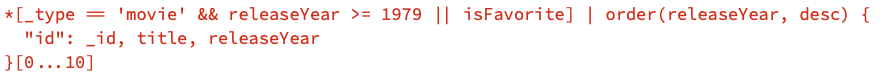

# SwiftyGROQ

A typesafe declarative syntax for making swifty GROQ queries.

## About
GROQ (Graph-Relational Object Queries) is an open source query language created and maintained by [Sanity](https://www.sanity.io). GROQ allows you to filter, sort, paginate and specify which data you want to mention just a subset of its features. You can learn more about GROQ [here](https://www.sanity.io/docs/how-queries-work).

### Motivation

If you use a GROQ enabled database for your Apple platform app, performing queries require you to store the queries as a string in your codebase. This has the following disadvantages:  

- Harder to read and understand the query
- Using variables in the query may require you to use string interpolation
- Queries are stored in plaintext in your app’s binary
- Not validated at compile time
- Has a special syntax you need to learn before using it

SwiftyGROQ attempts to solve many of these limitations by giving you a declarative and typesafe syntax.

In short, a query like this:  
  

Can be written like this:  


## Installation

To use this package in a SwiftPM project, you need to set it up as a package dependency:

```swift
// swift-tools-version:5.7
import PackageDescription

let package = Package(
  name: "MyPackage",
  dependencies: [
    .package(
      url: "https://github.com/Eskils/SwiftyGROQ.git", 
      .upToNextMinor(from: "1.0.0") // or `.upToNextMajor
    )
  ],
  targets: [
    .target(
      name: "MyTarget",
      dependencies: [
        .product(name: "SwiftyGROQ", package: "SwiftyGROQ")
      ]
    )
  ]
)
```

### Supported platforms

This library supports the following platform versions:  
- iOS 11.0
- macOS 10.13
- tvOS 11.0
- watchOS 4.0

## Usage

You can make a query with the `GROQuery` object and get the GROQ query string by accessing it’s `query` property:
```swift
let groq = GROQuery {
  Type("movie")
}

let query = groq.query // *[_type == "movie"]
performDatabase(query: query)
```

## Documentation
Queries can be constructed using a declarative syntax inspired by SwiftUI. 

The documentation reference for GROQ can be found [here](https://www.sanity.io/docs/groq-reference).

### Get entire database
```swift
// *
GROQuery()
```

### Special keys

Some queries require you to reference special keys when for instance querying the type or id of a document. Special keys can be accessed from the `SpecialGROQKey` enum:

```swift
// *[_id == "abc.123"]
GROQuery {
  Equal(SpecialGROQKey.id, "abc.123")
}
```

As querying for a particular document type is so common, a special structure, `Type` exists for that purpose:

```swift
// *[_type == "movie"]
GROQuery {
  Type("movie")
}

// Is equivalent to
GROQuery {
  Equal(SpecialGROQKey.type, "movie")
}

// Which is the same as 
GROQuery {
  Equal("_type", "movie")
}
```

### Filter comparison operators
Every comparison operator comes with a structure you can use, in addition to using the operator itself. For instance with the equals operator:

```swift
// *[releaseDate == 2018]
GROQuery {
  Equal("releaseDate", 2018)
}

// Can also be written as
GROQuery {
  releaseDate == 2018
}
```

Here is a list of all comparison operators and their corresponding structures:

| Structure            | Operator  |
|----------------------|-----------|
| `Not`                | `!`       |
| `Equal`              | `==`      |
| `NotEqual`           | `!=`      |
| `LessThan`           | `<`       |
| `GreaterThan`        | `>`       |
| `LessThanOrEqual`    | `<=`      |
| `GreaterThanOrEqual` | `>=`      |
| `In`                 | `in`      |
| `And`                | `&&`      |
| `Or`                 | `\|\|`      |
| `Match`              | `match`   |

Examples: 
```swift
// *[_type in ["movie", "person"]]
GROQuery {
  In(SpecialGROQKey.type, ["movie", "person"]) // Find all movies and people
}

// *[_type == "movie" && popularity > 15 || releaseDate > "2016-04-25"]
GROQuery {
  Type("movie") // && is assumed if no operator is specified
  GreaterThan("popularity", 15)
  || GreaterThan("releaseDate", "2016-04-25")
}

// *[popularity <= 15]
GROQuery {
  LessThanOrEqual("popularity", 15)
}

// *[!(releaseDate == "2016-04-27")]
GROQuery {
  Not(
    Equal("releaseDate", "2016-04-27")
  )
}

// *[title match "wo*"]
GROQuery {
  Match("title", "wo*")
}
```

### Slicing / Pagination

Slicing can be done by using the `Slice` structure or by applying a subscript to your `GROQuery`. Fetching documents by exclusive and inclusive ranges, as well as by a single index is supported.

Examples: 
```swift
// *[_type == "movie"][0...10]
GROQuery {
  Type("movie")
}[0..<10]

// *[_type == "movie"][0..10]
GROQuery {
  Type("movie")
  Slice(0...10)
}

// *[_type == "movie"][1]
GROQuery {
  Type("movie")
}[1]
```

### Ordering
Sorting the result of the query is a common task and can be done using the `.order` modifier function, or using the `Order` structure.

```swift 
// *[_type == "movie"] | order(_createdAt asc)
GROQuery {
  Type("movie")
}.order(byField: SpecialGROQKey.createdAt, direction: .ascending)

// *[_type == "movie"] | order(_createdAt desc)
GROQuery {
  Type("movie")
  Order("_createdAt", .descending)
}

// *[_type == "movie"] | order(releaseDate desc) | order(_createdAt asc)[0...10]
GROQuery {
  Type("movie")
}[0..<10]
  .order(byField: "releaseDate", direction: .descending)
  .order(byField: "_createdAt", direction: .ascending)

```

### Projection

You can choose which keys to include in your response by specifying in the `fields` block. Fields can be renamed, and new fields can be made by invoking functions.

```swift
/// *[_type == "movie"] { name, rating, releaseDate }[0...10]
GROQuery {
  Type("movie")
  Slice(0..<10)
} fields: {
  "name"
  "rating"
  "releaseDate"
}

// *[_type == "movie"] { "renamedId": _id, _type, title }
GROQuery {
  Type("movie")
} fields: {
  Field(renamedTo: "renamedId", SpecialGROQKey.id) // Rename field `_id` to `renamedId`
  SpecialGROQKey.type
  "title"
}

// *[_type == "movie"] { "actorCount": count(actors) }
GROQuery {
  Type("movie")
} fields: {
  All()
  Count(newFieldName: "actorCount", "actors") // Make a new field, `actorCount`, storing count of array `actors`
}

// *[_type == "movie"] { ..., "rating": coalesce(rating, "unknown") }
GROQuery {
  Type("movie")
} fields: {
  All()
  Coalesce(newFieldName: "rating", "rating", fallbackValue: "unknown") // Provide fallback value if field is unset
}
```

### Data Types
You can use native Swift data types like `String`, `Int`, and `Date` when constructing queries. Here is a list of all available data types structures and their corresponding GROQ data type:

| Swift data type           | GROQ data type   | Notes                                        |
|---------------------------|------------------|----------------------------------------------|
| `Bool`                    | `Boolean`        | --                                           |
| `Float`, `Double`         | `Float`          | Infinity and NaN are coerced to `null`       |
| `Int`                     | `Integer`        | --                                           |
| `NSNull`, `Optional.none` | `Null`           | Unknown / no value                           |
| `String`                  | `String`         | --                                           |
| `Array`                   | `Array`          | Only other GROQ-compatible types are allowed |
| `Dictionary`              | `Object`         | Only other GROQ-compatible types are allowed |
| `Pair`                    | `Pair`           | You may pass a tuple to Pair                 |
| `(Closed)Range`, `NSRange`| `Range`          | --                                           |
| `Date`                    | `Datetime`       | Produces an ISO 8601 string                  |
| `Path`                    | `Path`           | --                                           |

### Functions
Here is a list of all available function structures and their corresponding GROQ functions:

| Structure            | Function   |
|----------------------|------------|
| `Order`              | `\| order` |
| `Count`              | `count`    |
| `Coalesce`           | `coalesce` |
| `Lower`              | `lower`    |
| `Upper`              | `upper`    |
| `DateTime`           | `dateTime` |
| `Now`                | `now`      |
| `Defined`            | `defined`  |
| `Identity`           | `identity` |
| `Length`             | `length`   |
| `Path`               | `path`     |
| `ToString`           | `string`   |

## Roadmap

The most important aspects of building queries can already be used id SwiftyGROQ, but some parts have yet to be implemented. 
As an emergency fix, you can use `Custom` to write pure GROQ as a string:
```swift
// *[@["1"]]
GROQuery() {
  Custom("@[\"1\"]")
}
```

- ✅ Basic filters (!, ==, !=, <, >, <=, >=, in, &&, ||, match)
- ✅ Slice operations [pagination]
- ✅ Ordering
- ✅ Projection
- ✅ Data Types
- 🚧 Global functions (missing: references, round, select, score, string)
- ❌ Special variables (missing: @, ^)
- ❌ Conditionals
- ❌ Joins
- ❌ Object and array traversal
- ❌ Geolocation functions
- ❌ Portable text functions
- ❌ Sanity functions
- ❌ Delta functions
- ❌ Math functions
- ❌ String functions
- ❌ Array functions
- ❌ Query Scoring Pipes

## Contributing to SwiftyGROQ

Contributions are greatly welcomed. At this point, many features are still missing. Feel free to open issues and pull requests.

If you discover optimization routes, like saving space, memory or reducing build time—your sharing of knowledge is greatly appreciated.